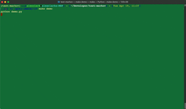

test-markov
================================================================================

Via https://docs.pymc.io/en/v3/about.html#purpose

PyMC3 is a probabilistic programming package for Python that allows users to fit Bayesian models using a variety of numerical methods, most notably Markov chain Monte Carlo (MCMC) and variational inference (VI). Its flexibility and extensibility make it applicable to a large suite of problems. Along with core model specification and fitting functionality, PyMC3 includes functionality for summarizing output and for model diagnostics.

Via https://towardsdatascience.com/introduction-to-linear-regression-in-python-c12a072bedf0

Linear regression is a basic predictive analytics technique that uses historical data to predict an output variable. It is popular for predictive modelling because it is easily understood and can be explained using plain English.

::

    ..[$] <( (git)-[main]-)> make demo
    python demo.py
    ['230.1', '37.8', '69.2', '22.1']
    /Users/alexclark/Developer/test-markov/lib/python3.10/site-packages/deprecat/classic.py:215: FutureWarning: In v4.0, pm.sample will return an `arviz.InferenceData` object instead of a `MultiTrace` by default. You can pass return_inferencedata=True or return_inferencedata=False to be safe and silence this warning.
      return wrapped_(*args_, **kwargs_)
    Auto-assigning NUTS sampler...
    Initializing NUTS using jitter+adapt_diag...
    Multiprocess sampling (4 chains in 4 jobs)
    NUTS: [noise, weights]
    Sampling 4 chains for 1_000 tune and 1_000 draw iterations (4_000 + 4_000 draws total) took 10 seconds. 226 divergences]
    There were 55 divergences after tuning. Increase `target_accept` or reparameterize.
    There were 63 divergences after tuning. Increase `target_accept` or reparameterize.
    There were 72 divergences after tuning. Increase `target_accept` or reparameterize.
    There were 36 divergences after tuning. Increase `target_accept` or reparameterize.

