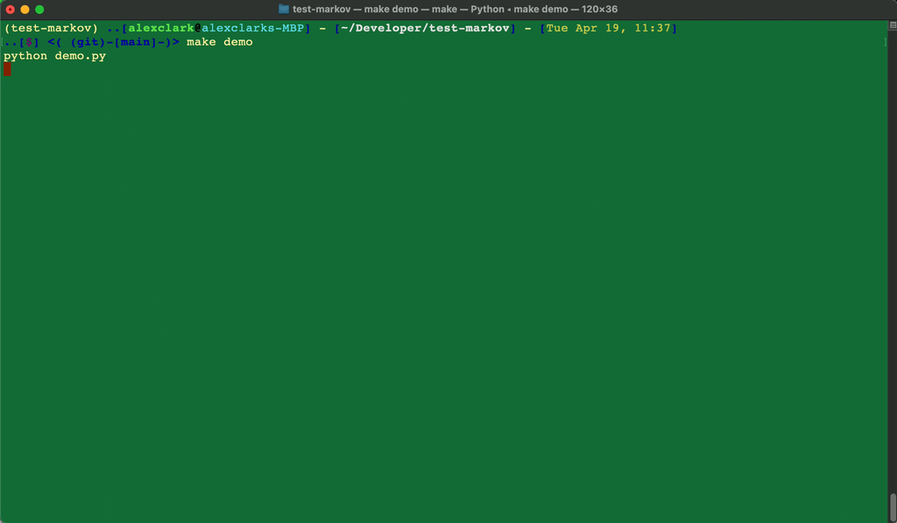

test-markov
================================================================================

Via https://docs.pymc.io/en/v3/about.html#purpose

PyMC3 is a probabilistic programming package for Python that allows users to fit Bayesian models using a variety of numerical methods, most notably Markov chain Monte Carlo (MCMC) and variational inference (VI). Its flexibility and extensibility make it applicable to a large suite of problems. Along with core model specification and fitting functionality, PyMC3 includes functionality for summarizing output and for model diagnostics.

Via https://towardsdatascience.com/introduction-to-linear-regression-in-python-c12a072bedf0

Linear regression is a basic predictive analytics technique that uses historical data to predict an output variable. It is popular for predictive modelling because it is easily understood and can be explained using plain English.

